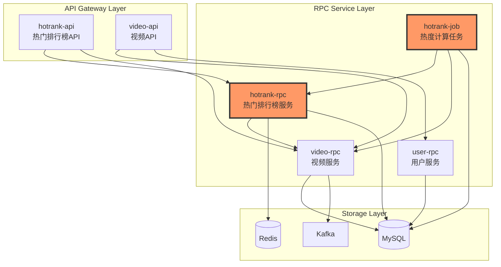

# MyBilibili 热门视频排行榜系统开发方案

## 一、项目整体架构设计

### 1.1 技术栈选型

```yaml
核心框架:
  - go-zero: 微服务框架（API网关、RPC服务）
  - gRPC: 服务间通信
  - Protocol Buffers: 接口定义

数据存储:
  - MySQL 8.0: 主数据存储（视频元数据、热度值）
  - Redis: 缓存层（热度排行榜、视频详情）
  - ElasticSearch: 搜索引擎（可选，用于复杂查询）

消息队列:
  - Kafka: 用户行为数据采集、异步任务处理

监控链路:
  - Prometheus: 指标监控
  - Jaeger: 分布式链路追踪
  - go-zero 内置链路追踪

开发工具:
  - goctl: go-zero 代码生成工具
  - Docker: 容器化部署
  - docker-compose: 本地开发环境
```

### 1.2 微服务拆分方案

```
mybilibili/
├── api/                          # API 网关层（对外提供 HTTP 接口）
│   ├── hotrank-api/             # 热门排行榜 API 服务
│   └── video-api/               # 视频基础 API 服务（依赖）
│
├── service/                      # RPC 服务层（内部服务）
│   ├── hotrank/                 # 热门排行榜服务（核心）
│   │   ├── rpc/                 # RPC 接口
│   │   └── job/                 # 定时任务（热度计算）
│   │
│   ├── video/                   # 视频服务（依赖）
│   │   └── rpc/                 # 视频元数据、统计数据
│   │
│   └── user/                    # 用户服务（依赖，简化版）
│       └── rpc/                 # 用户基本信息
│
├── common/                       # 公共组件
│   ├── model/                   # 数据模型
│   ├── errorx/                  # 错误码定义
│   ├── tool/                    # 工具函数
│   └── middleware/              # 中间件
│
├── deploy/                       # 部署相关
│   ├── docker/                  # Dockerfile
│   ├── k8s/                     # K8s 配置
│   └── sql/                     # 数据库脚本
│
└── doc/                         # 文档
    ├── api/                     # API 文档
    └── design/                  # 设计文档
```

### 1.3 服务依赖关系图



---

## 二、核心模块详细设计

### 2.1 热门排行榜服务（hotrank-rpc）

#### 2.1.1 服务职责

1. **热度计算**：基于多维度数据计算视频热度值
2. **排行榜管理**：维护不同维度的热门排行榜
3. **缓存管理**：管理热门视频的缓存策略
4. **数据查询**：提供排行榜数据查询接口

#### 2.1.2 Proto 接口定义

```protobuf
// service/hotrank/rpc/hotrank.proto
syntax = "proto3";

package hotrank;
option go_package = "./hotrank";

// 热门排行榜服务
service HotRank {
  // 获取全站热门排行榜
  rpc GetGlobalRanking(GlobalRankingReq) returns (RankingResp);
  
  // 获取分区热门排行榜
  rpc GetRegionRanking(RegionRankingReq) returns (RankingResp);
  
  // 获取单个视频热度值
  rpc GetVideoHotValue(VideoHotReq) returns (VideoHotResp);
  
  // 批量更新视频热度值（内部接口）
  rpc BatchUpdateHotValue(BatchUpdateReq) returns (BatchUpdateResp);
}

// 全站排行榜请求
message GlobalRankingReq {
  int32 page = 1;      // 页码
  int32 page_size = 2; // 每页数量
  string time_range = 3; // 时间范围：day/week/month/all
}

// 分区排行榜请求
message RegionRankingReq {
  int64 region_id = 1;   // 分区ID
  int32 page = 2;
  int32 page_size = 3;
  string time_range = 4;
}

// 排行榜响应
message RankingResp {
  repeated RankingItem list = 1;
  int32 total = 2;
}

message RankingItem {
  int64 vid = 1;          // 视频ID
  int64 hot_value = 2;    // 热度值
  int32 rank = 3;         // 排名
  VideoInfo video = 4;    // 视频信息
}

message VideoInfo {
  int64 vid = 1;
  string title = 2;
  string cover = 3;
  int64 author_id = 4;
  string author_name = 5;
  int64 pub_time = 6;
  VideoStat stat = 7;
}

message VideoStat {
  int64 view = 1;      // 播放
  int64 like = 2;      // 点赞
  int64 coin = 3;      // 硬币
  int64 fav = 4;       // 收藏
  int64 share = 5;     // 分享
  int64 reply = 6;     // 评论
  int64 danmaku = 7;   // 弹幕
}

// 视频热度请求
message VideoHotReq {
  int64 vid = 1;
}

message VideoHotResp {
  int64 vid = 1;
  int64 hot_value = 2;
  int64 updated_at = 3;
}

// 批量更新请求（内部使用）
message BatchUpdateReq {
  repeated HotValueItem items = 1;
}

message HotValueItem {
  int64 vid = 1;
  int64 hot_value = 2;
}

message BatchUpdateResp {
  int32 success_count = 1;
  int32 failed_count = 2;
}
```

#### 2.1.3 数据库设计

```sql
-- 热度记录表
CREATE TABLE `hot_rank` (
  `id` bigint NOT NULL AUTO_INCREMENT COMMENT '自增ID',
  `vid` bigint NOT NULL COMMENT '视频ID',
  `hot_value` bigint NOT NULL DEFAULT 0 COMMENT '热度值',
  `region_id` int NOT NULL DEFAULT 0 COMMENT '分区ID',
  `pub_time` datetime NOT NULL COMMENT '发布时间',
  `state` tinyint NOT NULL DEFAULT 0 COMMENT '状态：0-正常，1-删除',
  `created_at` datetime NOT NULL DEFAULT CURRENT_TIMESTAMP,
  `updated_at` datetime NOT NULL DEFAULT CURRENT_TIMESTAMP ON UPDATE CURRENT_TIMESTAMP,
  PRIMARY KEY (`id`),
  UNIQUE KEY `uk_vid` (`vid`),
  KEY `idx_hot_region` (`region_id`, `hot_value`, `state`),
  KEY `idx_hot_global` (`hot_value`, `state`),
  KEY `idx_updated` (`updated_at`)
) ENGINE=InnoDB DEFAULT CHARSET=utf8mb4 COMMENT='热度排行榜表';

-- 热度计算任务表（用于断点续传）
CREATE TABLE `hot_rank_job` (
  `id` bigint NOT NULL AUTO_INCREMENT,
  `batch_id` varchar(64) NOT NULL COMMENT '批次ID',
  `last_vid` bigint NOT NULL DEFAULT 0 COMMENT '最后处理的视频ID',
  `status` tinyint NOT NULL DEFAULT 0 COMMENT '状态：0-运行中，1-完成',
  `created_at` datetime NOT NULL DEFAULT CURRENT_TIMESTAMP,
  `updated_at` datetime NOT NULL DEFAULT CURRENT_TIMESTAMP ON UPDATE CURRENT_TIMESTAMP,
  PRIMARY KEY (`id`),
  KEY `idx_batch` (`batch_id`)
) ENGINE=InnoDB DEFAULT CHARSET=utf8mb4 COMMENT='热度计算任务表';
```

#### 2.1.4 Redis 缓存设计

```go
// Redis Key 设计
const (
    // 全站热门排行榜 ZSET：hot:rank:global:{time_range}
    // Score: hot_value, Member: vid
    KeyGlobalRanking = "hot:rank:global:%s"
    
    // 分区热门排行榜 ZSET：hot:rank:region:{region_id}:{time_range}
    KeyRegionRanking = "hot:rank:region:%d:%s"
    
    // 视频热度值 STRING：hot:value:{vid}
    KeyVideoHotValue = "hot:value:%d"
    
    // 视频详情缓存 HASH：video:info:{vid}
    KeyVideoInfo = "video:info:%d"
)

// 缓存过期时间
const (
    GlobalRankingTTL = 30 * time.Minute  // 排行榜30分钟
    VideoHotValueTTL = 10 * time.Minute  // 热度值10分钟
    VideoInfoTTL = 60 * time.Minute      // 视频信息1小时
)
```

### 2.2 热度计算任务（hotrank-job）

#### 2.2.1 任务职责

1. **定时触发**：每小时执行一次热度计算
2. **批量计算**：分批处理视频，每批30-100个
3. **热度更新**：更新数据库和缓存
4. **排行榜刷新**：重建 Redis 排行榜

#### 2.2.2 核心算法实现

```go
// service/hotrank/job/internal/logic/hotcalclogic.go
package logic

import (
    "context"
    "math"
    "time"
)

// HotCalculator 热度计算器
type HotCalculator struct {
    // 权重配置（从配置文件读取，支持热更新）
    weights HotWeights
}

type HotWeights struct {
    Coin    float64 `json:"coin"`    // 硬币权重
    Fav     float64 `json:"fav"`     // 收藏权重
    Danmaku float64 `json:"danmaku"` // 弹幕权重
    Reply   float64 `json:"reply"`   // 评论权重
    View    float64 `json:"view"`    // 播放权重
    Like    float64 `json:"like"`    // 点赞权重
    Share   float64 `json:"share"`   // 分享权重
    NewBoost float64 `json:"new_boost"` // 新视频提权倍数
}

// CalculateHotValue 计算热度值
func (c *HotCalculator) CalculateHotValue(stat *VideoStat, pubTime time.Time) int64 {
    // 多维度加权计算
    hot := float64(stat.Coin)*c.weights.Coin +
           float64(stat.Fav)*c.weights.Fav +
           float64(stat.Danmaku)*c.weights.Danmaku +
           float64(stat.Reply)*c.weights.Reply +
           float64(stat.View)*c.weights.View +
           float64(stat.Like)*c.weights.Like +
           float64(stat.Share)*c.weights.Share
    
    // 新视频提权（24小时内）
    if time.Since(pubTime) <= 24*time.Hour {
        hot *= c.weights.NewBoost
    }
    
    return int64(math.Floor(hot))
}

// BatchCalculate 批量计算热度
func (c *HotCalculator) BatchCalculate(ctx context.Context, videos []*VideoData) map[int64]int64 {
    result := make(map[int64]int64, len(videos))
    
    for _, v := range videos {
        hotValue := c.CalculateHotValue(v.Stat, v.PubTime)
        result[v.Vid] = hotValue
    }
    
    return result
}
```

#### 2.2.3 任务调度流程

```go
// service/hotrank/job/internal/logic/schedulelogic.go
package logic

// HotRankJob 热度排行榜任务
type HotRankJob struct {
    ctx context.Context
    svcCtx *svc.ServiceContext
    calculator *HotCalculator
}

// Run 执行任务
func (j *HotRankJob) Run() error {
    // 1. 生成批次ID
    batchID := generateBatchID()
    
    // 2. 获取上次处理的位置（支持断点续传）
    lastVid, err := j.getLastProcessedVid(batchID)
    if err != nil {
        return err
    }
    
    // 3. 循环处理所有视频
    for {
        // 3.1 分页查询视频列表
        videos, err := j.svcCtx.VideoRpc.GetVideoList(j.ctx, &video.VideoListReq{
            LastVid: lastVid,
            Limit: 100,
        })
        if err != nil {
            return err
        }
        
        if len(videos.List) == 0 {
            break // 处理完成
        }
        
        // 3.2 批量计算热度值
        hotValues := j.calculator.BatchCalculate(j.ctx, videos.List)
        
        // 3.3 批量更新数据库
        err = j.svcCtx.HotRankModel.BatchUpdate(j.ctx, hotValues)
        if err != nil {
            return err
        }
        
        // 3.4 更新缓存
        err = j.updateCache(j.ctx, hotValues)
        if err != nil {
            return err
        }
        
        // 3.5 更新断点位置
        lastVid = videos.List[len(videos.List)-1].Vid
        err = j.saveCheckpoint(batchID, lastVid)
        if err != nil {
            return err
        }
    }
    
    // 4. 重建排行榜
    err = j.rebuildRanking(j.ctx)
    if err != nil {
        return err
    }
    
    // 5. 标记任务完成
    err = j.markJobCompleted(batchID)
    if err != nil {
        return err
    }
    
    return nil
}

// 重建排行榜
func (j *HotRankJob) rebuildRanking(ctx context.Context) error {
    // 1. 从数据库查询 Top 1000
    hotList, err := j.svcCtx.HotRankModel.GetTopN(ctx, 1000)
    if err != nil {
        return err
    }
    
    // 2. 写入 Redis ZSET
    for _, item := range hotList {
        // 全站排行榜
        err = j.svcCtx.Redis.ZAdd(ctx, 
            fmt.Sprintf(KeyGlobalRanking, "all"),
            redis.Z{Score: float64(item.HotValue), Member: item.Vid},
        ).Err()
        
        // 分区排行榜
        err = j.svcCtx.Redis.ZAdd(ctx,
            fmt.Sprintf(KeyRegionRanking, item.RegionId, "all"),
            redis.Z{Score: float64(item.HotValue), Member: item.Vid},
        ).Err()
    }
    
    return nil
}
```

### 2.3 视频服务（video-rpc）

#### 2.3.1 服务职责

1. **视频元数据管理**：标题、封面、作者、发布时间等
2. **视频统计数据**：播放、点赞、收藏等（从Kafka消费）
3. **视频列表查询**：支持分页、筛选

#### 2.3.2 Proto 接口定义

```protobuf
// service/video/rpc/video.proto
syntax = "proto3";

package video;
option go_package = "./video";

service Video {
  // 获取视频详情
  rpc GetVideoInfo(VideoInfoReq) returns (VideoInfoResp);
  
  // 批量获取视频信息
  rpc BatchGetVideoInfo(BatchVideoInfoReq) returns (BatchVideoInfoResp);
  
  // 获取视频列表（分页）
  rpc GetVideoList(VideoListReq) returns (VideoListResp);
  
  // 获取视频统计数据
  rpc GetVideoStat(VideoStatReq) returns (VideoStatResp);
  
  // 批量获取统计数据
  rpc BatchGetVideoStat(BatchVideoStatReq) returns (BatchVideoStatResp);
}

message VideoInfoReq {
  int64 vid = 1;
}

message VideoInfoResp {
  VideoInfo info = 1;
}

message BatchVideoInfoReq {
  repeated int64 vids = 1;
}

message BatchVideoInfoResp {
  map<int64, VideoInfo> infos = 1;
}

message VideoInfo {
  int64 vid = 1;
  string title = 2;
  string cover = 3;
  int64 author_id = 4;
  string author_name = 5;
  int64 region_id = 6;
  int64 pub_time = 7;
  int32 duration = 8;
  string desc = 9;
}

message VideoListReq {
  int64 last_vid = 1;  // 游标分页
  int32 limit = 2;
}

message VideoListResp {
  repeated VideoData list = 1;
}

message VideoData {
  VideoInfo info = 1;
  VideoStat stat = 2;
}

message VideoStatReq {
  int64 vid = 1;
}

message VideoStatResp {
  VideoStat stat = 1;
}

message BatchVideoStatReq {
  repeated int64 vids = 1;
}

message BatchVideoStatResp {
  map<int64, VideoStat> stats = 1;
}

message VideoStat {
  int64 vid = 1;
  int64 view = 2;
  int64 like = 3;
  int64 coin = 4;
  int64 fav = 5;
  int64 share = 6;
  int64 reply = 7;
  int64 danmaku = 8;
  int64 updated_at = 9;
}
```

#### 2.3.3 数据库设计

```sql
-- 视频基本信息表
CREATE TABLE `video_info` (
  `id` bigint NOT NULL AUTO_INCREMENT,
  `vid` bigint NOT NULL COMMENT '视频ID',
  `title` varchar(255) NOT NULL COMMENT '标题',
  `cover` varchar(512) NOT NULL COMMENT '封面',
  `author_id` bigint NOT NULL COMMENT '作者ID',
  `author_name` varchar(64) NOT NULL COMMENT '作者名称',
  `region_id` int NOT NULL COMMENT '分区ID',
  `duration` int NOT NULL COMMENT '时长（秒）',
  `desc` text COMMENT '简介',
  `pub_time` datetime NOT NULL COMMENT '发布时间',
  `state` tinyint NOT NULL DEFAULT 0 COMMENT '状态',
  `created_at` datetime NOT NULL DEFAULT CURRENT_TIMESTAMP,
  `updated_at` datetime NOT NULL DEFAULT CURRENT_TIMESTAMP ON UPDATE CURRENT_TIMESTAMP,
  PRIMARY KEY (`id`),
  UNIQUE KEY `uk_vid` (`vid`),
  KEY `idx_author` (`author_id`),
  KEY `idx_region` (`region_id`),
  KEY `idx_pub_time` (`pub_time`)
) ENGINE=InnoDB DEFAULT CHARSET=utf8mb4 COMMENT='视频基本信息表';

-- 视频统计表
CREATE TABLE `video_stat` (
  `id` bigint NOT NULL AUTO_INCREMENT,
  `vid` bigint NOT NULL COMMENT '视频ID',
  `view` bigint NOT NULL DEFAULT 0 COMMENT '播放数',
  `like_count` bigint NOT NULL DEFAULT 0 COMMENT '点赞数',
  `coin` bigint NOT NULL DEFAULT 0 COMMENT '硬币数',
  `fav` bigint NOT NULL DEFAULT 0 COMMENT '收藏数',
  `share` bigint NOT NULL DEFAULT 0 COMMENT '分享数',
  `reply` bigint NOT NULL DEFAULT 0 COMMENT '评论数',
  `danmaku` bigint NOT NULL DEFAULT 0 COMMENT '弹幕数',
  `created_at` datetime NOT NULL DEFAULT CURRENT_TIMESTAMP,
  `updated_at` datetime NOT NULL DEFAULT CURRENT_TIMESTAMP ON UPDATE CURRENT_TIMESTAMP,
  PRIMARY KEY (`id`),
  UNIQUE KEY `uk_vid` (`vid`)
) ENGINE=InnoDB DEFAULT CHARSET=utf8mb4 COMMENT='视频统计表';
```

---

## 三、API 网关层设计

### 3.1 热门排行榜 API（hotrank-api）

#### 3.1.1 API 定义

```go
// api/hotrank-api/hotrank.api
syntax = "v1"

info(
    title: "热门排行榜API"
    desc: "提供热门视频排行榜查询接口"
    author: "mybilibili"
    version: "v1.0"
)

type (
    // 全站排行榜请求
    GlobalRankingRequest {
        Page int32 `form:"page,default=1"`
        PageSize int32 `form:"page_size,default=20"`
        TimeRange string `form:"time_range,default=all,options=day|week|month|all"`
    }
    
    // 分区排行榜请求
    RegionRankingRequest {
        RegionId int64 `form:"region_id"`
        Page int32 `form:"page,default=1"`
        PageSize int32 `form:"page_size,default=20"`
        TimeRange string `form:"time_range,default=all"`
    }
    
    // 排行榜响应
    RankingResponse {
        List []RankingItem `json:"list"`
        Total int32 `json:"total"`
        Page int32 `json:"page"`
        PageSize int32 `json:"page_size"`
    }
    
    RankingItem {
        Vid int64 `json:"vid"`
        Rank int32 `json:"rank"`
        HotValue int64 `json:"hot_value"`
        Video VideoInfo `json:"video"`
    }
    
    VideoInfo {
        Vid int64 `json:"vid"`
        Title string `json:"title"`
        Cover string `json:"cover"`
        AuthorId int64 `json:"author_id"`
        AuthorName string `json:"author_name"`
        PubTime int64 `json:"pub_time"`
        Stat VideoStat `json:"stat"`
    }
    
    VideoStat {
        View int64 `json:"view"`
        Like int64 `json:"like"`
        Coin int64 `json:"coin"`
        Fav int64 `json:"fav"`
        Share int64 `json:"share"`
        Reply int64 `json:"reply"`
        Danmaku int64 `json:"danmaku"`
    }
)

@server(
    group: hotrank
    prefix: /api/v1/hotrank
)
service hotrank-api {
    @doc "获取全站热门排行榜"
    @handler GetGlobalRanking
    get /global (GlobalRankingRequest) returns (RankingResponse)
    
    @doc "获取分区热门排行榜"
    @handler GetRegionRanking
    get /region (RegionRankingRequest) returns (RankingResponse)
}
```

---

## 四、项目目录结构

```
mybilibili/
├── api/
│   ├── hotrank-api/                    # 热门排行榜 API
│   │   ├── etc/
│   │   │   └── hotrank-api.yaml       # 配置文件
│   │   ├── internal/
│   │   │   ├── config/
│   │   │   │   └── config.go
│   │   │   ├── handler/
│   │   │   │   └── hotrankhandler.go
│   │   │   ├── logic/
│   │   │   │   └── hotranklogic.go
│   │   │   ├── svc/
│   │   │   │   └── servicecontext.go
│   │   │   └── types/
│   │   │       └── types.go
│   │   ├── hotrank.api
│   │   └── hotrank.go
│   │
│   └── video-api/                      # 视频 API
│       └── ...
│
├── service/
│   ├── hotrank/
│   │   ├── rpc/                       # RPC 服务
│   │   │   ├── etc/
│   │   │   │   └── hotrank.yaml
│   │   │   ├── internal/
│   │   │   │   ├── config/
│   │   │   │   ├── logic/
│   │   │   │   ├── server/
│   │   │   │   └── svc/
│   │   │   ├── pb/
│   │   │   │   └── hotrank.pb.go
│   │   │   ├── hotrank.proto
│   │   │   └── hotrank.go
│   │   │
│   │   └── job/                       # 定时任务
│   │       ├── etc/
│   │       │   └── hotrank-job.yaml
│   │       ├── internal/
│   │       │   ├── config/
│   │       │   ├── logic/
│   │       │   │   ├── hotcalclogic.go     # 热度计算
│   │       │   │   └── schedulelogic.go     # 任务调度
│   │       │   └── svc/
│   │       └── hotrank-job.go
│   │
│   ├── video/
│   │   └── rpc/
│   │       ├── etc/
│   │       ├── internal/
│   │       ├── pb/
│   │       ├── video.proto
│   │       └── video.go
│   │
│   └── user/
│       └── rpc/
│           └── ...
│
├── common/
│   ├── model/                         # 数据模型
│   │   ├── hotrankmodel/
│   │   ├── videomodel/
│   │   └── usermodel/
│   ├── errorx/                        # 错误码
│   │   └── errorx.go
│   ├── tool/                          # 工具函数
│   │   ├── timex/
│   │   └── mathx/
│   └── middleware/                    # 中间件
│       ├── auth/
│       └── ratelimit/
│
├── deploy/
│   ├── docker/
│   │   ├── Dockerfile.api
│   │   ├── Dockerfile.rpc
│   │   └── Dockerfile.job
│   ├── docker-compose.yml
│   ├── k8s/
│   │   ├── hotrank-api.yaml
│   │   ├── hotrank-rpc.yaml
│   │   └── hotrank-job.yaml
│   └── sql/
│       ├── 001_init.sql
│       └── 002_hotrank.sql
│
├── go.mod
├── go.sum
├── Makefile
└── README.md
```

---

## 五、开发流程和最佳实践

### 5.1 开发步骤

```bash
# 第一阶段：基础设施搭建（1-2天）
1. 初始化项目结构
2. 配置 docker-compose（MySQL、Redis、Kafka、Jaeger）
3. 编写数据库初始化脚本
4. 配置 goctl 模板（参考 go-zero-looklook）

# 第二阶段：RPC 服务开发（3-4天）
1. 定义 Proto 文件
2. 使用 goctl 生成代码
3. 实现 video-rpc 基础服务
4. 实现 hotrank-rpc 核心服务
5. 编写单元测试

# 第三阶段：Job 任务开发（2-3天）
1. 实现热度计算算法
2. 实现任务调度逻辑
3. 实现断点续传机制
4. 测试性能和准确性

# 第四阶段：API 网关开发（2天）
1. 定义 API 文件
2. 使用 goctl 生成代码
3. 实现业务逻辑
4. 接口联调测试

# 第五阶段：优化和部署（2-3天）
1. 缓存优化
2. 性能测试和调优
3. 编写部署文档
4. K8s 部署配置
```

### 5.2 Go-Zero 最佳实践

#### 5.2.1 项目结构规范

```go
// 参考 go-zero-looklook 的目录组织方式

// 1. 配置文件统一管理
type Config struct {
    zrpc.RpcServerConf
    
    // MySQL 配置
    MySQL struct {
        DataSource string
    }
    
    // Redis 配置
    Redis redis.RedisConf
    
    // 业务配置
    HotWeights struct {
        Coin float64
        Fav float64
        // ...
    }
}

// 2. ServiceContext 统一依赖注入
type ServiceContext struct {
    Config Config
    
    // 数据库
    HotRankModel hotrankmodel.HotRankModel
    VideoModel videomodel.VideoModel
    
    // RPC 客户端
    VideoRpc video.Video
    
    // Redis
    Redis *redis.Redis
}

// 3. 错误码统一管理
package errorx

var (
    ErrVideoNotFound = errorx.NewCodeError(10001, "视频不存在")
    ErrHotValueCalcFailed = errorx.NewCodeError(20001, "热度计算失败")
)
```

#### 5.2.2 代码生成最佳实践

```bash
# API 代码生成
$ goctl api go -api hotrank.api -dir . -style gozero

# RPC 代码生成
$ goctl rpc protoc hotrank.proto --go_out=. --go-grpc_out=. --zrpc_out=. --style gozero

# Model 代码生成（从数据库）
$ goctl model mysql ddl -src 001_init.sql -dir ./model -c -style gozero
```

#### 5.2.3 链路追踪配置

```yaml
# hotrank-api.yaml
Name: hotrank-api
Host: 0.0.0.0
Port: 8888

# 链路追踪
Telemetry:
  Name: hotrank-api
  Endpoint: http://jaeger:14268/api/traces
  Sampler: 1.0
  Batcher: jaeger

# Prometheus 指标
Prometheus:
  Host: 0.0.0.0
  Port: 9091
  Path: /metrics
```

### 5.3 性能优化策略

#### 5.3.1 缓存策略

```go
// 三级缓存架构
type CacheStrategy struct {
    // L1: 本地缓存（进程内）
    localCache *bigcache.BigCache
    
    // L2: Redis 缓存
    redis *redis.Redis
    
    // L3: MySQL 数据库
    db *sql.DB
}

// 查询流程
func (c *CacheStrategy) GetVideoInfo(vid int64) (*VideoInfo, error) {
    // 1. 查询本地缓存
    if info, ok := c.localCache.Get(vid); ok {
        return info, nil
    }
    
    // 2. 查询 Redis
    if info, err := c.getFromRedis(vid); err == nil {
        c.localCache.Set(vid, info)
        return info, nil
    }
    
    // 3. 查询数据库
    info, err := c.getFromDB(vid)
    if err != nil {
        return nil, err
    }
    
    // 4. 回填缓存
    c.setToRedis(vid, info)
    c.localCache.Set(vid, info)
    
    return info, nil
}
```

#### 5.3.2 批量查询优化

```go
// 使用 dataloader 模式批量查询
type VideoLoader struct {
    videoRpc video.Video
    loader *dataloader.Loader
}

func NewVideoLoader(videoRpc video.Video) *VideoLoader {
    return &VideoLoader{
        videoRpc: videoRpc,
        loader: dataloader.NewBatchedLoader(batchFn, options...),
    }
}

func (l *VideoLoader) Load(vid int64) (*VideoInfo, error) {
    thunk := l.loader.Load(context.Background(), dataloader.StringKey(strconv.FormatInt(vid, 10)))
    result, err := thunk()
    if err != nil {
        return nil, err
    }
    return result.(*VideoInfo), nil
}
```

---

## 六、监控和运维

### 6.1 监控指标

```yaml
# 业务指标
- 热度计算耗时
- 热度计算成功率
- 排行榜查询 QPS
- 排行榜查询延迟 P99

# 系统指标
- RPC 调用成功率
- Redis 命中率
- MySQL 慢查询数量
- Kafka 消息堆积量
```

### 6.2 告警规则

```yaml
# prometheus-rules.yaml
groups:
  - name: hotrank_alerts
    rules:
      - alert: HotRankCalcFailed
        expr: rate(hotrank_calc_failed_total[5m]) > 0.1
        annotations:
          summary: "热度计算失败率过高"
          
      - alert: RankingQuerySlow
        expr: histogram_quantile(0.99, hotrank_query_duration_seconds) > 1
        annotations:
          summary: "排行榜查询P99延迟超过1秒"
```

---

## 七、总结和后续规划

### 7.1 本期实现范围

✅ **已规划实现**：
1. 热门排行榜核心服务（hotrank-rpc + hotrank-job）
2. 视频基础服务（video-rpc）
3. API 网关层（hotrank-api）
4. 热度计算算法
5. Redis 缓存策略
6. 监控链路追踪

### 7.2 可扩展性设计

预留扩展点：
1. **用户个性化排行榜**：基于用户画像调整权重
2. **实时热度计算**：接入 Flink 流计算
3. **多维度排行榜**：按分区、标签、时间等维度
4. **AB实验平台**：热度算法 AB 测试
5. **弹幕、评论服务**：独立微服务
6. **搜索服务**：ElasticSearch 全文检索

### 7.3 技术债务和优化方向

1. **性能优化**：引入本地缓存，减少 Redis 调用
2. **数据一致性**：考虑引入分布式事务（Seata）
3. **高可用**：Redis 哨兵/集群，MySQL 主从
4. **自动化测试**：单元测试覆盖率达到 80%

---

**下一步**：根据这个方案，我可以开始生成具体的代码实现。您觉得这个方案是否合理？有哪些地方需要调整？